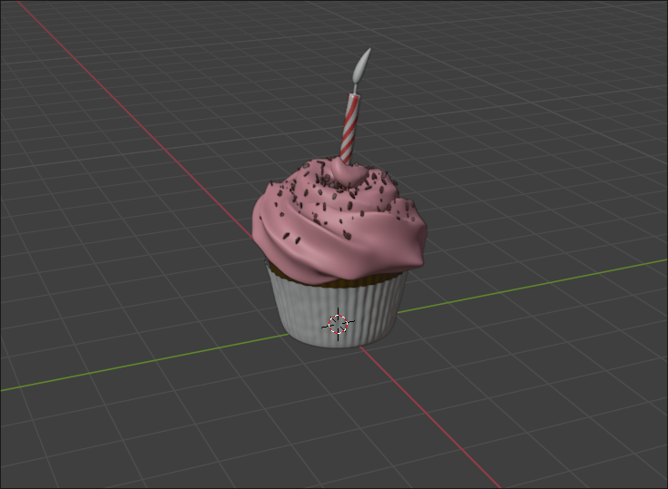
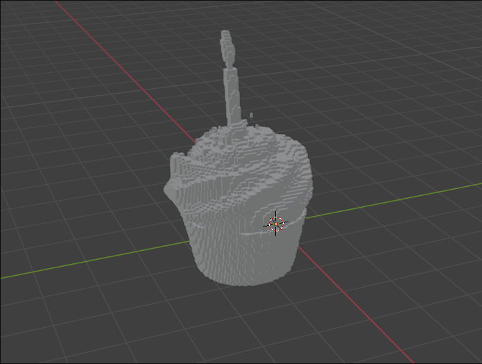
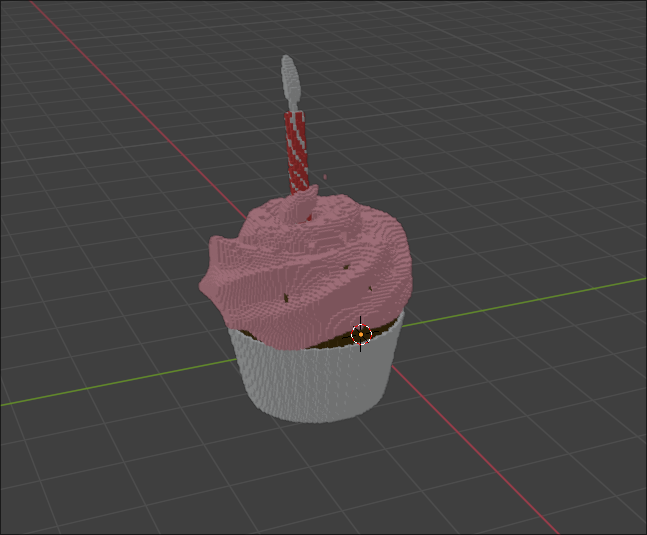

Based on https://github.com/mariogeiger/obj2voxel

Tool for .obj to voxel or bricks(merged voxels) colorized conversion:
input.obj -(fn load_obj)-> vertices, faces, color info -(fn obj2voxel)-> voxels(flat u8 arr), color info -(fn merge_voxels)-> bricks(with 1 × 1 size if merging is not specified), color info -(fn save_as_obj)-> output.obj

**Tool features:**

- voxel merging (horizontal one-dimensional brick merging) available
- color aware conversion available

**Usage:**

    exe [input_file_path] [size(voxel_grid)] [output_file_path] --max-merge-length(opt) [max_merge_length] --mtl-file-path(opt) [mtl_file_path]

    - input_file_path, output_file_path - input and output obj file paths
    - mtl_file_path(opt) - mtl file path for color aware conversion
    - size(voxel_grid) - the size in voxels of the resulting grid dimensions (voxel grid will be size × size × size)
    - max_merge_length(opt) - max amount of voxels to horizontal one-dimensional brick merging (every brick will be either 1 × max_merge_length size or max_merge_length × 1 size). If not specified, the merge will not be applied

**Examples:**

*input model:

- `exe input.obj 100 output1.obj`:
Loaded 30895 bricks from 30895 voxels, *saved ./output1.obj file:

- `exe input.obj 150 output2.obj --max-merge-length 5 --mtl-file-path model.mtl`:
Loaded 35069 bricks from 69552 voxels, *saved ./output2.obj file:

**Some details:**

- merging with the applied mtl file may work worse cause of the color difference
- compiled exe will be named "constructor" as specified in Cargo.toml

